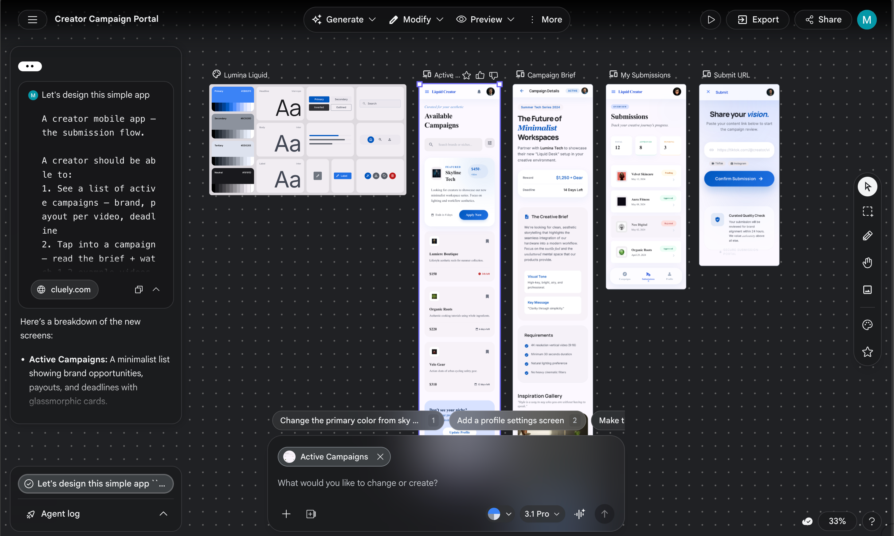

1. initialize the project with a simple expo template
```bash
➜  8x-social git:(main) npx rn-new@latest
Need to install the following packages:
rn-new@2.21.3
Ok to proceed? (y) y

  _ __  _ __       _ __    ___ __      __
 | '__|| '_ \     | '_ \  / _ \\ \ /\ / /
 | |   | | | |    | | | ||  __/ \ V  V /
 |_|   |_| |_|    |_| |_| \___|  \_/\_/

┌  Let's get started!
│
◇  What do you want to name your project?
│  my-expo-app
│
◇  Would you like to use a saved configuration?
│  No
│
◇  Would you like to use TypeScript with this project?
│  Yes
Good call, now using TypeScript! 🚀
│
◇
We've detected npm v11.11.0 as your preferred package manager.
Would you like to continue using it?
│  No
│
◇  Gotcha! Which package manager would you like to use?
│  bun
│
◇  What would you like to use for Navigation?
│  Expo Router
│
◇  What type of navigation would you like to use?
│  Tabs
│
◇  What would you like to use for styling?
│  Nativewind
You'll be styling with ease using Nativewind!
│
◇  What would you like to use for state management?
│  Zustand
You'll be using zustand for state management.
│
◇  What would you like to use for authentication?
│  None
No problem, skipping authentication for now.
│
◇  Do you want to setup EAS
│  Yes
We'll setup EAS for you.
│
◇  Would you like to save this configuration for future use?
│  Yes
│
◇  What do you want to name this configuration?
│  not_bloated

Your project configuration:
{
  projectName: 'my-expo-app',
  packages: [
    {
      name: 'expo-router',
      type: 'navigation',
      options: { type: 'tabs' }
    },
    { name: 'nativewind', type: 'styling' },
    { name: 'zustand', type: 'state-management' }
  ],
  flags: {
    noGit: false,
    noInstall: false,
    overwrite: false,
    importAlias: true,
    packageManager: 'bun',
    eas: true,
    publish: false
  }
}

To recreate this project, run:
  npx rn-new@latest my-expo-app --expo-router --tabs --nativewind --zustand --bun --eas
│
◇  Project initialized!
│
◇  Base assets copied!
│
(node:51305) [DEP0190] DeprecationWarning: Passing args to a child process with shell option true can lead to security vulnerabilities, as the arguments are not escaped, only concatenated.
(Use `node --trace-deprecation ...` to show where the warning was created)
◇  Dependencies installed!
│
◇  Packages updated!
│
$ eslint "**/*.{js,jsx,ts,tsx}" --fix && prettier "**/*.{js,jsx,ts,tsx,json}" --write
◒  Cleaning up your project.(node:51755) ESLintEnvWarning: /* eslint-env */ comments are no longer recognized when linting with flat config and will be reported as errors as of v10.0.0. Replace them with /* global */ comments or define globals in your config file. See https://eslint.org/docs/latest/use/configure/migration-guide#eslint-env-configuration-comments for details. Found in /Users/mikeb/build/jobs/8x-social/my-expo-app/eslint.config.js at line 1.
(Use `node --trace-warnings ...` to show where the warning was created)
◇  Project files formatted!
│
◇  Git initialized!
Configuring EAS...

EAS CLI not found, to continue please install it globally

│
◇  Install EAS CLI?
│  No

/bin/sh: eas: command not found
Error configuring EAS: {"stdout":null,"status":127,"error":null}
failed to run command: cd my-expo-app && eas build:configure -p all
➜  8x-social git:(main) ✗
```

2. Generate the UI for the app using Stich


